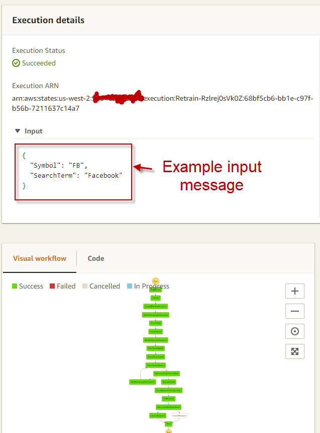

# continuous-training
Used for continuous training of a Machine Learning model based on evolving data. Application based on AWS technology, including SageMaker, Glue, Athena, and StepFunctions.

Steps to use this project:

1) Download and install the [base-resources.json](https://raw.githubusercontent.com/paulfryer/continuous-training/master/base-resources.json) cloud formation template. This will build out the base resources for the project, which consist of:
1. Kinesis Firehoses for entities extracted and items.
2. Glue crawlers for items, entities, and index data.
3. Roles for Sagemaker.
4. S3 bucket.

This project can use [Diffbot](https://www.diffbot.com/get-started/) for text extraction from HTML, so you'll need to get a Diffbot Token if you choose to use this. There is another text extraction service that doesn't work as well, it's set as the default so you don't need to register with Diffbot if you are OK using this one. [Change implementation here](https://github.com/paulfryer/continuous-training/blob/master/ContinuousTraining/StateMachine/Extraction.cs#L111).
This project uses [Alpha Vantage](https://www.alphavantage.co/support/#api-key) for stock prices, so you'll need to get a API Key from them too.

2) After you have launched the base template you can launch the [DotStep starter](https://github.com/paulfryer/dotstep#install-the-starter-project) cloud formation template, but replace all instances of "dotnet-starter" with "continuous-training" in the cloud formation parameters.

* StackName = ct
* SourceCodeDirectory = continuous-training-master
* SourceCodeZip = https://codeload.github.com/paulfryer/continuous-training/zip/master

This will import the source code into your own private git repository in CodeCommit. A CI/CD pipeline will be built to automatically deploy your code every time you check in. Let the CodePipeline complete and deploy your step functions via a new cloud formation template called "{stackname}-deplolyment". This will take several minutes to build and deploy, you can view the CodePipeline to watch progress.

The first step function you should run is the "Crawler". You need to provide two parameters to the step function:
1) SearchTerm, this should be the company name you are searching for, like "Amazon"
2) Symbol, this should be the stock symbol of the company you are searching for, like "AMZN"

The crawler will kick off instances of the "Extractor" step function which will grab news articles about your search term and extract entities from it. The entities and news items are sent to Kinesis Firehoses and delivered to S3. 

Once the data is on S3 a Glue crawler will build shemas for the data so they can be queries via Athena. 

The "Retrain" function will trigger the crawler to add any new partitions, build training data, and submit a training job to Sagemaker. Finally the new model will be published to a Sagemaker prediction endpoint. 

Now you can send the extracted entities of a news articles to Sagemaker to get a prediction of how the stock price for a company will behave in 1 day, based on the characterizations of the extracted entities.

3) After you have trained a model and a SageMaker endpoint is deployed you can run a new news story through the "Predict" function to see what the model thinks the 1 day stock price change will be based on the entities/confidence scores extracted from that article. Submit the "Symbol" and "SearchTerm" parameters to this function. Note: as of Aprill 11th, 2018 the predicted value coming back is always the same - seems the XGBoost algorithm needs some tuning, I suspect the inital branch is always going down one path that ends with the same value.
